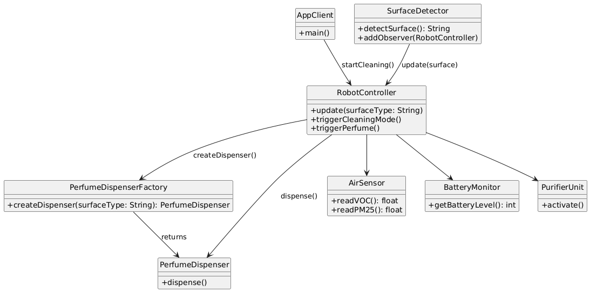

# Software Engineering (SE) Lab 6 Report – JMS-Based Distributed UC Demonstrator (Firmware Team)

### Authors

| Family name | First name(s) | Student ID | *Partner* |
|-------------|----------------|------------|------------|
| Fahim       | Md Abrar       | 2642215    | B (Firmware) |
| Sagor       | Mir Md Redwon  | 2613747    | B (Firmware) |

### Version  

FINAL

---

## Prerequisites

| What you check/do now | Why and for what purpose |
| --------------------- | ------------------------ |
| Lab 4 task sheet      | Confirm UC-cluster, patterns, diagrams |
| Design Pattern Code   | Verified Observer, Decorator, Factory implemented |
| git pulled            | Pulled latest changes from partner |
| report 5 pushed       | Started and pushed this preparation report |

---

## Glossary

| Term | Acronym | Description |
|------|---------|-------------|
| RV | Robot Vacuum | Autonomous floor cleaning robot |
| VOC | - | Volatile Organic Compounds (air pollutants) |
| LiDAR | - | Sensor for mapping and obstacle detection |
| OTA | - | Over-the-Air firmware update |
| PerfumeSettings | - | Data object for storing fragrance configuration |

---

## 1. Base Documents

### 1a. UC Cluster

Selected UC Cluster: **Adaptive Cleaning & Perfume Dispensing**
- **UC-9**: Adaptive Cleaning Intensity
- **UC-10**: Adaptive Perfume Dispensing

These UCs involve reacting to floor type changes and user-defined perfume settings. The robot adapts cleaning power and optionally releases scent based on these inputs.

### 1b. Design Patterns

| Pattern  | Reason | Class Involved |
| -------- | ------ | -------------- |
| Observer | Sensor update triggers adaptive action | SurfaceDetector, RobotController |
| Decorator | Enhance base perfume dispensing logic | PerfumeDispenser subclasses |
| Factory | Create appropriate perfume dispenser variant | PerfumeDispenserFactory |

### 1c. Class Diagram & main()

- Main class: `RobotController.java`
- Event flow: `SurfaceDetector` → `RobotController` → `PerfumeDispenserFactory` → `PerfumeDispenser`
- UC classes and methods are documented in BlueJ with full field/method listings.
- For MOM-based class layout, refer to Section 5.4.

---

### UC-Diagram with Properties/Fields and Methods

The following updated class diagram shows the structural design for our **Dustdash Firmware UC-Cluster Demonstrator**:

- The `AppClient` calls remote methods via `RobotControlInterface`
- The robot-side implementation resides in `RobotControlImpl`, which integrates modules like:
  - `SurfaceDetector`, `AirSensor`, `BatteryMonitor`
  - `PerfumeDispenserFactory` and its product `PerfumeDispenser`
  - `PurifierUnit` for indoor air management
- Shared objects like `PerfumeSettings` are used for data transport between App and Robot
- The class `AppStatusCallback` is used by the server to send updates to the App client
- The main method is located in the `Server.java`, which exports the `RobotControlImpl` instance and binds it to the RMI registry

#### Class Diagram (Client, Shared, Server)



---

## 2. Client-Server (CS) Demonstrator Basics

### 2.1 Functionality

- **Client**: App initiates remote actions.
- **Server**: Robot executes them and optionally provides callback.
- App calls `startAdaptiveCleaning()` and `setPerfumeSettings(...)`
- Robot can send back messages via callback to client using `notifyStatus(...)`

**State Change Behavior (Complexity Requirement 3)**:
- App triggers adaptive cleaning → Robot modifies internal state (e.g., mode, sensor thresholds).
- Robot then uses callback to update app status (e.g., "Cleaning started on tile surface").


### 2.2 Provision and CS-Separation

| Server Side         | Shared Objects                | Client Side |
|---------------------|-------------------------------|-------------|
| RobotControlImpl    | PerfumeSettings (Serializable) | AppClient   |
| SurfaceDetector     |                               |             |
| AirSensor           |                               |             |
| PerfumeDispenserFactory |                          |             |
| PerfumeDispenser    |                               |             |

---

## 3. Client-Server Contract

### 3.1 Conceptual Understanding

- Interfaces abstract system behavior across distributed systems.
- Allow client to invoke server functionality without knowing implementation.
- Server defines service contract (Remote Interface).
- Data classes must be serializable for transport.
- Contracts enable maintainable, loosely-coupled architectures.

### 3.2 Client-Server Interfaces

#### Interface 1: `RobotControlInterface` (server)
```java
public interface RobotControlInterface extends Remote {
    void startAdaptiveCleaning() throws RemoteException;
    void setPerfumeSettings(PerfumeSettings settings) throws RemoteException;
    void registerCallback(AppStatusCallback client) throws RemoteException;
}


#### Interface 2: `AppStatusCallback` (client - RMI)
```java
public interface AppStatusCallback extends Remote {
    void notifyStatus(String message) throws RemoteException;
}

```

#### Shared Data Class: PerfumeSettings
```java
public class PerfumeSettings implements Serializable {
    private int intensity;
    private boolean enabled;

    public PerfumeSettings(int intensity, boolean enabled) {
        this.intensity = intensity;
        this.enabled = enabled;
    }

    public int getIntensity() { return intensity; }
    public boolean isEnabled() { return enabled; }
}

```

- `RobotControlInterface:Service:` is Invoked by the app (client)
- `AppStatusCallback:` Invoked by server for callback (server)

---


## 4. Technical Realization with Java RMI (Lab 5)

### 4.1 Technical Understanding

| Aspect                  | Condition               | Example                                           |
|-------------------------|-------------------------|---------------------------------------------------|
| a. `Remote`             | Required for RMI        | `RobotControlInterface`, `AppStatusCallback`      |
| b. `Serializable`       | For data transfer       | `PerfumeSettings`                                 |
| c. `UnicastRemoteObject`| Server object           | `RobotControlImpl`                                |
| d. `Naming.rebind()`    | Register remote object  | `Naming.rebind("Robot", new RobotControlImpl())`  |

- All remote methods must throw `RemoteException`.
- The RMI Registry binds names to exported remote objects so clients can locate and invoke them.
- Singleton Note: The server object (like `RobotControlImpl`) registered in the RMI registry behaves as a singleton because it is looked up and reused.


For detailed behavior of proxy objects and registry mechanisms, refer to:
**SE_07b_Renz_DistributedSystems_1.pdf**, Lecture 9 – Distributed Systems.

---

### 4.2 Class Diagram – Java RMI Implementation


- 🔵 **Remote Interfaces**: `RobotControlInterface`, `AppStatusCallback`
- 🟢 **Serializable Data Classes**: `PerfumeSettings`
- 🟣 **Remote Objects (UnicastRemoteObject)**: `RobotControlImpl`
- 🟠 **Registry Binding**: Done in `Server.java` using `Naming.rebind()`


### Sequence Diagram – RMI Use Case Flow

This diagram illustrates the RMI interaction for perfume setting and cleaning initiation:


---

### 5. Design for MOM-based Demonstrator (Lab 6 prep)

#### 5.1 Conceptual Understanding

- **What is the role of the message queue (MQ) in MOM?**  
  In Message-Oriented Middleware (MOM), the Message Queue (MQ) acts as a decoupling mechanism between sender and receiver components. It enables:
  - Asynchronous communication: sender and receiver do not need to be active at the same time.
  - Reliable delivery: messages are stored and forwarded even if the receiver is temporarily offline.
  - Scalability: multiple producers and consumers can exchange messages efficiently through queues and topics.
  - Fault tolerance and resilience: system components can fail or restart without data loss or coupling.

- **Why is the class design of the JMS-distributed demonstrator very similar to that of the RMI-distributed demonstrator?**  
  Despite the different transport layers (synchronous vs. asynchronous), the core system logic, object responsibilities, and use case flow remain identical between RMI and JMS implementations. The similarities arise from the consistent domain model and architecture.

#### **Identical Elements Between RMI and JMS Versions:**

1. **Domain Model Classes**  
   - Core classes such as `RobotController`, `PerfumeDispenser`, `PerfumeSettings`, and `SurfaceDetector` retain the same responsibilities and interactions.

2. **Design Pattern Usage**  
   - **Observer**: `SurfaceDetector` notifies `RobotController` on floor-type changes.  
   - **Decorator**: `PerfumeDispenser` behavior is extended for different fragrance logic.  
   - **Factory**: `PerfumeDispenserFactory` dynamically creates dispenser variants based on context.

3. **Functional Event Flow**  
   - The same chain of interaction is maintained:
     - `SurfaceDetector` detects surface type  
     - It notifies the `RobotController`  
     - The controller triggers logic in the factory and dispenser to adjust cleaning and perfume behavior

4. **Shared Data and DTOs**  
   - `PerfumeSettings` remains the common object exchanged between App and Robot in both models. It is `Serializable` in RMI and used in `ObjectMessage` in JMS.

5. **Client-Server Role Split**  
   - The **App** remains the **client**, initiating commands  
   - The **Robot firmware** remains the **server**, executing logic and sending status updates

In short, only the communication middleware changes—core system structure and logic do not.

---

#### **Key Differences in the MOM-Based Design (Compared to RMI):**

1. **Message Routing**  
   - JMS routes messages based on the `type` property (e.g., `SET_PERFUME`), not method names.

2. **Communication Model**  
   - JMS is asynchronous and decoupled, while RMI is synchronous and blocking.

3. **Callback Mechanism**  
   - MOM uses publish-subscribe topics for callbacks, not direct method invocations.

4. **Data Handling & Message Semantics**  
   - JMS messages can include metadata (headers/properties) for flexible routing and filtering.

5. **Middleware Role**  
   - ActiveMQ acts as a **message broker** that buffers, dispatches, and monitors messages.

6. **Contract Realization**  
   - RMI uses shared remote interfaces.
   - JMS uses agreed-upon **message formats**, **queues/topics**, and **DTOs** to define the implicit contract.

---

#### **Two MOM Services and Their Use Cases:**

| MOM Service Type        | Use Case in This Project                             |
|-------------------------|------------------------------------------------------|
| **Queue (Point-to-Point)** | Used for direct commands like `SET_PERFUME` from App to Robot |
| **Topic (Publish-Subscribe)** | Used for broadcasting status updates like `STATUS_UPDATE` from Robot to App |

The queue and topic communicate messages labeled with MessageKeys.SET_PERFUME and MessageKeys.STATUS_UPDATE.

---

### 5.2 Technical Understanding

The Java Message Service (JMS) provides a standardized API for asynchronous message-based communication. Unlike RMI, which uses method stubs and interfaces, JMS operates through message queues and topics, decoupling the sender and receiver. Below is a breakdown of how JMS works technically in our Lab 6 implementation.

---

#### Why does `javax.jms` only define interfaces?

The `javax.jms` package is a standard API that defines only **interfaces** (like `Connection`, `Session`, `Message`, etc.) to ensure vendor independence. It allows systems to switch between providers (e.g., ActiveMQ, RabbitMQ) without changing application logic.

Actual objects are created using **vendor-specific factories**.

##### Example of JMS-based object creation:
```java
ConnectionFactory factory = new ActiveMQConnectionFactory("tcp://localhost:61616");
Connection connection = factory.createConnection();
Session session = connection.createSession(false, Session.AUTO_ACKNOWLEDGE);
Destination queue = session.createQueue("robot.control");
MessageProducer producer = session.createProducer(queue);
```

---

#### Client-Server Component Roles and Startup Sequence

- **JMS Server**: Apache ActiveMQ (message broker)
- **Client (App-side logic)**:
  - `AppClient` and `AppStatusCallbackCaller` – send commands
  - `AppStatusCallbackResponder` – receives status updates from robot
- **Server (Robot-side logic)**:
  - `RobotControlResponder` – listens to command queue and dispatches actions

---

#### How to inspect queues/messages?

Used the **ActiveMQ Web Console** at:
```
http://localhost:8161
```
This interface shows live stats of queues, topics, consumers, producers, and pending messages.

---

##### What We Can Inspect:

- **Queues and Topics**:
  - e.g., `robot.control`, `status.update`
  - View message counts (pending, enqueued, dequeued)

- **Message Traffic**:
  - Monitor real-time message flow
  - Check active producers and consumers

- **Message Content**:
  - Inspect headers (`type`, `JMSCorrelationID`, etc.)
  - View payloads (TextMessage/ObjectMessage)

- **Connected Clients**:
  - Identify subscribers and publishers

---

##### Use in Our Demonstrator

- **Queue**: `robot.control`
  - Used by `AppClient` to send commands
  - Consumed by `RobotControlResponder`

- **Topic**: `status.update`
  - Published by `RobotControlResponder`
  - Subscribed to by `AppStatusCallbackResponder`

This setup allows us to:
- Confirm message flow
- Debug communication issues
- Validate `type` properties (`SET_PERFUME`, `STATUS_UPDATE`)

---

#### Which classes define the Client-Server (C-S) contract in JMS?

In JMS, the C-S contract is implicitly defined by:
- **Queue/Topic Names** (e.g., `robot.control`, `status.update`)
- **Message Properties** such as `type`
- **Shared DTOs**, e.g., `PerfumeSettings` exchanged via `ObjectMessage`

In our demonstrator:
- `MessageKeys` defines valid `type` strings
- `PerfumeSettings` is the shared data class
- Queue/topic names represent communication channels

---

#### Why does the Caller implement the `LaborkursInterface`?

In the RMI model, the client implements `LaborkursInterface` to call remote methods via stubs.

In the JMS model, there's no interface. Instead, the client **simulates** method calls using message properties:

```java
TextMessage msg = session.createTextMessage("Clean now!");
msg.setStringProperty("type", "SET_PERFUME");
```

---

#### Which is the corresponding class in RMI-Laborkurs?

The corresponding class is `LaborkursInterface`, which extends `java.rmi.Remote`.

You can inspect it using Java reflection:

```java
for (Method m : LaborkursInterface.class.getMethods()) {
    System.out.println(m.getName());
}
```

---

#### Why is `Student` placed in the `serobjs` package for JMS?

JMS requires that classes used in `ObjectMessage` are deserialized only if they belong to **trusted packages**.

To allow this, we place `Student` or `PerfumeSettings` in `serobjs`, and register it like this:

```java
connection.setTrustedPackages(Arrays.asList("serobjs"));
```
---

#### What happens if you remove `serobjs` from the trusted packages in `JMSClient`?

- The JMS client will throw a `SecurityException`
- The message will be rejected
- Deserialization of the object will fail

---

#### Which mechanism is used in the Responder to define message-specific handlers?

In the Responder (e.g., `RobotControlResponder`), routing is handled via the `type` property:

```java
String type = message.getStringProperty("type");

switch (type) {
    case "SET_PERFUME":
        handleSetPerfume(message);
        break;
    case "STATUS_REQUEST":
        handleStatusRequest(message);
        break;
}
```

---

#### What do the lambda expressions in `setMessageListener()` define?

They implement `javax.jms.MessageListener`, specifically:

```java
consumer.setMessageListener(message -> {
    handleMessage(message);
});
```

This is equivalent to:
```java
public void onMessage(Message message) {
    handleMessage(message);
}
```

---

#### What is the difference between JMS-Eliza and JMS-Laborkurs?

| Feature                | JMS-Eliza                      | JMS-Laborkurs                               |
|------------------------|--------------------------------|---------------------------------------------|
| Message Handling       | Hardcoded logic                | Dynamic dispatch via `type`                 |
| Flexibility            | Low                            | High                                        |
| Method Simulation      | None                           | Multi-method simulation                     |
| Architecture           | Toy example                    | Realistic, scalable pattern                 |

Our Lab 6 design follows the **Laborkurs** model.

---

#### How does the message structure in the Caller support Responder-side logic?

The Caller sets a message property called `type` to trigger logic on the Responder side:

```java
TextMessage msg = session.createTextMessage("Set perfume");
msg.setStringProperty("type", "SET_PERFUME");
```

The Responder then dispatches the message accordingly.

---

#### Why is there only a client-side Caller and server-side Responder?

In JMS:
- Communication is **asynchronous and queue-driven**
- No remote interfaces are needed
- The **Caller** sends a message
- The **Responder** listens and reacts

This supports:
- Loose coupling  
- Flexibility  
- Event-driven architecture

---

### 5.3 Design of the MOM-Based Client-Server Demonstrator

#### Server Side

The **server-side** of our MOM-based system is the **Robot Firmware**, specifically the class `RobotControlResponder`.  
It listens for incoming commands on a JMS queue (`robot.control`) and executes appropriate logic based on the `type` property of the message.

---

#### Classes of the Client-Server Contract

In our MOM-based demonstrator, the contract is defined by:

- **MessageKeys.java**
  - These keys simulate method names from RMI and are essential for dynamic message routing in the responder.
  - Contains string constants such as `"SET_PERFUME"` and `"STATUS_UPDATE"`
  - Used by both client and server to classify message intent

- **PerfumeSettings.java**
  - A shared **DTO class**
  - Implements `Serializable`
  - Fields:
    - `int intensity`
    - `boolean enabled`

---

#### Caller and Responder Classes

- **Caller (Client side)**:
  - `AppClient` – Initiates cleaning and perfume commands
  - `AppStatusCallbackCaller` – Sends command messages to the queue
  - `AppStatusCallbackResponder` – Listens for robot status updates on the topic `status.update`

- **Responder (Server side)**:
  - `RobotControlResponder` – Subscribes to `robot.control`, receives commands, and dispatches them
  - Implements multiple handlers for various message types like `SET_PERFUME`, `STATUS_REQUEST`

Note:  
Each of these classes may implement logic for multiple operations.  
For example, `RobotControlResponder` handles **both** cleaning and perfume-related message types.


---

### 5.4 BlueJ Class Diagram

The updated BlueJ diagram visually represents the separation between the App (client) and the Robot Firmware (server) in our MOM-based architecture.

- **Left**: Server-side classes (`RobotControlResponder`, handlers, sensors)
- **Middle**: Shared classes (`PerfumeSettings`, `MessageKeys`)
- **Right**: Client-side classes (`AppClient`, `AppStatusCallbackCaller`, `AppStatusCallbackResponder`)

---

#### BlueJ Class Diagram – MOM Implementation


---


- `AppStatusCallbackCaller` → `RobotControlResponder` (via queue)
- `RobotControlResponder` → `AppStatusCallbackResponder` (via topic)

This architectural separation using JMS enables **asynchronous**, **loosely coupled**, and **event-driven** communication between the App and Robot.


---

## 6. Realization with JMS and ActiveMQ (Lab 6)

### 6.1 Final BlueJ Class Diagram


See the submitted `.png` file with our final BlueJ class diagram.

**Layout:**
- **Left**: Server-side (Robot firmware)
  - Includes `RobotControlResponder`, `RobotControlImpl`, `Server`, `PerfumeDispenserFactory`, sensor-related classes, and `BasePerfumeDispenser`
- **Middle**: Shared classes and DTOs
  - `PerfumeSettings`, `MessageKeys`, interfaces like `RobotControlInterface` and `AppStatusCallback`
- **Right**: Client-side (App logic)
  - `AppClient`, `AppStatusCallbackCaller`, `AppStatusCallbackResponder`, `RobotControlCaller`

The structure follows the **MOM design principles**, where message flow is handled via:
- **JMS queue**: `robot.control`
- **JMS topic**: `status.update`
---

### 6.2 Demonstrator Input and Output

- **GUI Screenshot**: Not applicable (console-based interaction)
- **User Input/Menu**: Handled via terminal interface in `AppClient`

#### Terminal Output – Server (RobotControlResponder):
```text
Received: PerfumeSettings(intensity=3, enabled=true)
Sent: Perfume set to intensity 3
```

#### Terminal Output – Client (AppClient):
```text
Status: Perfume set to intensity 3
```

These outputs confirm correct end-to-end behavior of our MOM-based demonstrator.

---

## Appendix A (SE Glossary)

| Term                    | Acronym | Description                                                  |
|-------------------------|---------|--------------------------------------------------------------|
| Concept                 | -       | Prototypic class in domain model without methods             |
| Boundary Concept        | -       | Receives or sends events from or to external actors          |
| Knowing Concepts        | -       | Data classes                                                 |
| Association             | -       | Relationship between classes                                 |
| Domain Model            | DM      | Concepts defined based on responsibilities and associations  |
| Design Pattern          | -       | Reusable solution structure for design problems              |
| Observer Pattern Reason | -       | Notify controller of sensor updates (e.g., surface changes)  |
| Decorator Pattern Reason| -       | Extend perfume logic dynamically                             |
| Strategy Pattern Reason | -       | Enable dynamic behavior switching for cleaning modes         |
| Command Pattern Reason  | -       | Encapsulate commands sent to robot for clean action separation |
| Factory Pattern Reason  | -       | Dynamically create different perfume dispenser variants      |
| Remote Interface        | -       | Interface that extends `java.rmi.Remote` (RMI only)          |
| Serializable            | -       | Class eligible for transmission over network                 |
| UnicastRemoteObject     | -       | Exported object allowing remote access (RMI only)            |

---

## Appendix B (AI Support)

| Section     | Prompt Summary                                                                 |
|-------------|---------------------------------------------------------------------------------|
| 5.1–5.4     | Used ChatGPT to structure MOM-based explanation and compare with RMI concepts   |
| 6.1–6.2     | Reviewed technical realization and simulated message outputs                    |
| Glossary    | AI helped clarify and format glossary entries to match SE domain expectations   |
| Report-Wide | Ensured formatting compliance, class role accuracy, and message-based routing logic |

**Tool Usage Declaration:**  
We used OpenAI ChatGPT as an assistance tool strictly for clarification, explanation, and refinement of our Markdown structure and software engineering concepts.  
All inputs were based on lecture materials, lab instructions, and our original code.

---